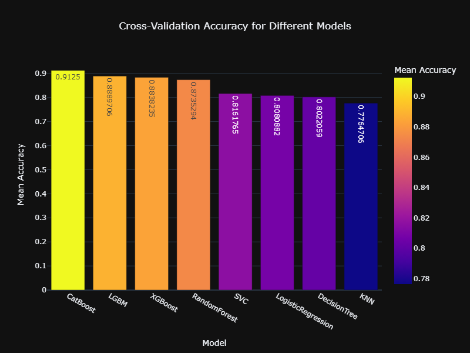
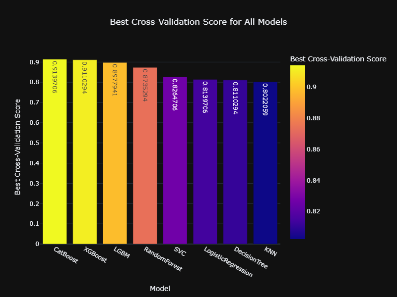
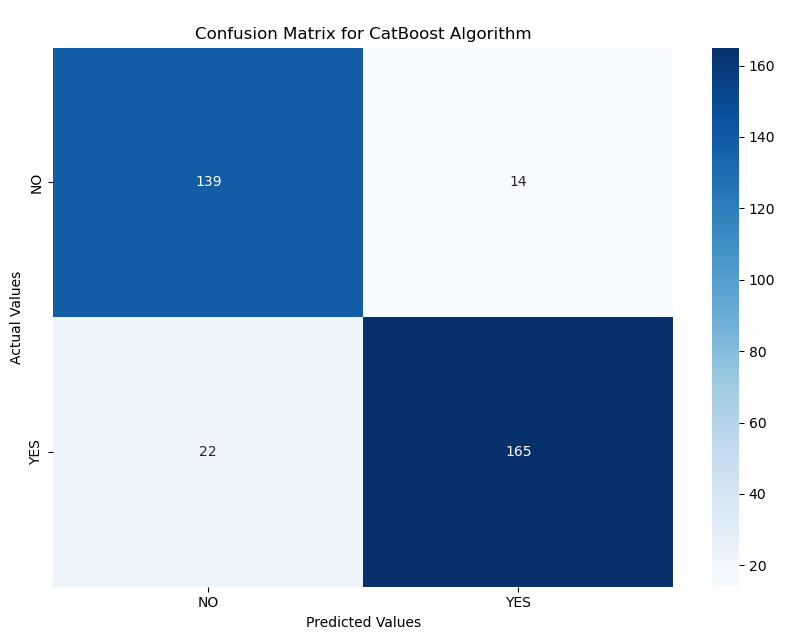

# Liver Disease Prediction

## Introduction

The purpose of this dataset is that it shed light on factors influencing liver health. The significance is that it aids in predictive modeling and healthcare.

The size of the data contains 1,500 records and the features encompassing demographics, lifestyle, and health indicators. 

#### Features
* **Age**: 20 to 80 years old
* **Gender**: Male (0) or Female (1)
* **BMI (Body Mass Index)**: 15 to 40 units
* **Alcohol Consumption**: 0 to 20 units per week
* **Smoking**: No (0) or Yes (1)
* **Genetic Risk**: Low (0), Medium (1), High (2)
* **Physical Activity**: 0 to 10 hours per week
* **Diabetes**: No (0) or Yes (1)
* **Hypertension**: No (0) or Yes (1)
* **Liver Function Test**: Range of 20 to 100 units
* **Diagnosis (Target Variable)**: Binary indicator (0 or 1) of liver disease presence 

#### Disclaimer

This dataset has been preprocessed and cleaned to ensure that users can focus on the most critical aspects of their analysis. The preprocessing steps were designed to eliminate noise and irrelevant information, allowing us to concentrate on developing and fine-tuning our predictive models.  

#### Exclusive Synthetic Dataset

This dataset is synthetic and was generated for educational purposes, making it ideal for data science and machine learning projects. It is an original dataset, owned by *Mr. Rabie El Kharoua*, and has not been previously shared. 

---

## Business Understanding

**Business Question**: Can we predict if our patient have liver disease?

#### Goals
* Analyze our data to find insights of how features correlate to the diagnosis of liver disease.
* Build and compare different models to predict liver disease diagnosis.
* Find the most effective model for diagnosis.

---

## Analytical Approach

Based on the *business question*, this analytical approach focuses on statistical analysis because we want to predict if the patient have liver disease, and our target variable, *Diagnosis*, has a binary indicator (0 for no, or 1 for yes) of liver disease present that is a classification problem in our dataset. 

---

## Data Requirement

* The domain knowledge is in healthcare.
* Obtaining records of patients from various hospitals that contains demographics, physical activities, diagnosis status, etc.

---

## Data Collection

This data can be collected by questionnaires (similar to how doctors or nurse ask questions to patients at a clinic), testing, and measurements (BMI, weight, height, blood pressure, etc.). 

#### Disclaimer
This dataset was downloaded from [Kaggle](https://www.kaggle.com/datasets/rabieelkharoua/predict-liver-disease-1700-records-dataset/data) for research purposes.

---

## Data Understanding

The dataset analysis revealed key insights into various patient characteristics relevant to liver disease prediction. Age distribution showed a bimodal pattern, with peaks in the early 40s to late 50s and late 60s to early 70s. Gender was almost evenly split, minimizing bias. BMI analysis highlighted normal weight as the most common category, while underweight was rare, and alcohol consumption averaged nearly 9.8 units weekly for both genders, with peaks between 16–17 units. Most patients did not smoke (70.8%), had low genetic risk (32.8% medium, 9.71% high), were non-diabetic (85.8%), and did not have hypertension (84.5%). Physical activity distribution was uniform, with females slightly more active than males.

Liver function tests showed a uniform range of 25–95, and 55.1% of patients were diagnosed with liver disease. Feature analysis by diagnosis suggested BMI could be correlated to liver disease, and a heatmap confirmed alcohol consumption and liver function tests as having the strongest correlations with diagnosis, while physical activity showed the weakest correlation. This exploration identified potentially significant predictors of liver disease.

---

## Data Preparation

We split our data into two variables called $X$, where it contains all features except our target variable, and $y$, where it contains only our target variable. We transform our $X$ variable by using `MinMaxScalar`, so it can fit in our DataFrame. Our last step of our preparation is to split our data into training and testing set.

---

## Modeling

For modeling section, we grabbed several classification machine learning models to help us with our task:

* Random Forest
* eXtreme Boost (XGBoost)
* Light Gradient Boost Machine (LGBM)
* Decision Tree
* K-Nearest Neighbor
* Support Vector Machine (SVC)
* Logistic Regression
* CatBoost

---

## Evaluation

After initializing our classifiers, then we train our models by using *cross-validation*, and score by *mean accuracy score*.

The scores below shows the mean accuracy by default parameters in our machine learning models.

||Mean Accuracy Score|
|:-:|:---:|
|CatBoost|0.912|
|LGBM|0.889|
|XGBoost|0.884|
|Random Forest|0.874|
|SVC|0.816|
|Logistic Regression|0.808|
|Decision Tree|0.802|
|KNN|0.776|

Based on the results, we can see that the best model for this task is `CatBoost`, but we should do some tuning; which we use `GridSearchCV` with hyperparameter for each model. This will help find the best model with its best parameters without under-fitting or over-fitting our model.

||Best Score|
|:-:|:--:|
|CatBoost|0.914|
|XGBoost|0.911|
|LGBM|0.898|
|Random Forest|0.874|
|SVC|0.826|
|Logistic Regression|0.814|
|Decision Tree|0.811|
|KNN|0.802|

As you can see that `CatBoost` classifier is still the best model for our task. Now, we can use our model to score the training and testing set by using *accuracy*, *precision*, *recall*, and *F1-Score*. We will also display a confusion matrix of our best model.   

||CatBoost|
|:-:|:--:|
|Training Accuracy|0.99|
|Training Precision|1.00|
|Training Recall|0.99|
|Training F1-Score|0.99|
|Test Accuracy|0.89|
|Test Precision|0.92|
|Test Recall|0.88|
|Test F1-Score|0.90|

We also created a *Classification Report*:

||Precision|Recall|F1-Score|Support|
|:-:|:-:|:-:|:-:|:-:|
|NO|0.86|0.91|0.89|153|
|YES|0.92|0.88|0.90|187|
|Accuracy|N/A|N/A|0.89|340|
|Macro AVG|0.89|0.90|0.89|340|
|Weighted AVG|0.90|0.89|0.89|340|

---